


&nbsp;&nbsp;**Hi humans, I'm Keyaruga**

My real name is **Amir Hossein Abdi** — a Full-Stack Developer &amp; Software Engineer.

 

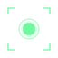 **Online**
&nbsp;&nbsp;·&nbsp;&nbsp;
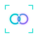 **Open Source**
&nbsp;&nbsp;·&nbsp;&nbsp;
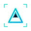 **Arch Linux**
&nbsp;&nbsp;·&nbsp;&nbsp;
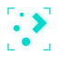 **KDE Plasma**

  

<a href="https://github.com/keyaruga33" title="GitHub">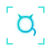</a>
&nbsp;&nbsp;

&nbsp;&nbsp;

&nbsp;&nbsp;&nbsp;

 

  

 

## 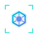 「The Second Run」

If I could go back to the beginning, I think it would be somewhere around twelve or thirteen.

I was just trying to build a widget for the shitty little blog I had back then. They told me it was JavaScript, so I went to learn JavaScript. Then I found out I needed HTML and CSS first, so I learned those too.

One thing led to another.

Python came next, then JavaScript again, followed by Java, Go, C++, and whatever else caught my attention along the way.

I never stopped at the language itself either. Django, Flask, Vue, React, Qt, Qt Quick... every time I thought I had found where I belonged, I found another door worth opening.

Years later, I still can't tell you what my field is.

Web, desktop, backend, systems...

I've touched all of them, but I never stayed in one place long enough to call it mine.

Maybe that's what my path has always been.

Not choosing one road.

**Just refusing to stop walking.**

And if I were given another chance to start over...

I'd probably do it all again.

## 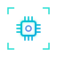 「Skills」

After walking through all those paths, these are the ones I know my way around.

  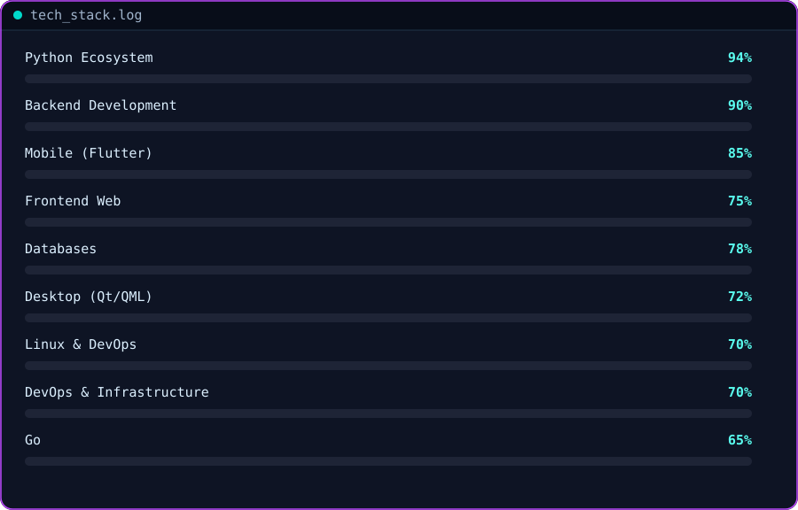

### 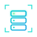 Backend &amp; Servers

- 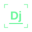 **Django**
- 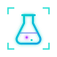 **Flask**
- 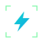 **FastAPI**
-  **Golang**

###  Databases

- 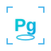 **PostgreSQL** — experience building a video search engine, text processing pipelines, and vector search
- 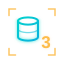 **SQLite3**

###  Web Frontend

-  **JavaScript**
-  **TypeScript**
- 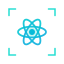 **React.js**
- 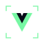 **Vue.js**

### 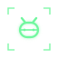 Mobile

- 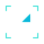 **Dart** &amp;  **Flutter**
- 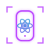 **React Native**

###  Desktop

- 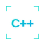 **C++** &amp; 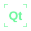 **Qt**
- 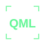 **Qt Quick (QML)**
-  Windows &nbsp;/&nbsp; 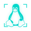 Linux &nbsp;/&nbsp; 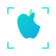 macOS

### 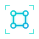 Bots

- 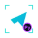 **Telebot** — Python
-  **Telebot** — Golang
- 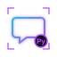 **Rubipy** — Rubika

**Different languages. Different platforms. Different paths.**

**Somehow, I ended up learning a little of all of them.**

## 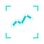 「Current Timeline」

Of all the paths I've taken, some were forgotten.

Some became projects.

And some are still being built.

These days, I don't really care about having a single title anymore.

I just build whatever seems worth building.

A desktop application.
A backend.
A mobile app.
A bot.
A tool nobody asked for.

Or sometimes, something completely pointless that I simply wanted to see exist.

###  Pasban DB

One of the projects closest to me.

A database of **20,000+ pure Persian words**, built over nearly **two years** of work.

It grew beyond a database into a website, bots, applications, and tools built around the language itself.

What started as a project eventually became a piece of something I genuinely care about.

### 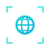 Parsi Virast

A project developed in collaboration with **Parsi Anjoman**, focused on Persian proofreading, writing, and the Persianization of written content.

Because code isn't the only thing worth preserving.

## 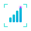 「System Activity」


## 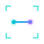 「A Strange Combination」

I suppose there's something slightly contradictory about me.

I can spend hours talking about anime, games, Linux, and obscure pieces of technology...

while at the same time being deeply interested in **Persian language, Iranian culture, and the history of this land**.

I don't really see a contradiction in that.

I can be an anime fan and still care about my language.

I can write code in English and still want to preserve Persian.

I can build for the future while carrying something from the past with me.

Maybe that's another path I've chosen.

**To create new things without forgetting where I came from.**

And perhaps that's why the name is a little strange too.

**Keyaruga.**

An anime character's name...

carried by someone who spends his time trying to build things for his own language.

Different worlds.

Same timeline.

 

 &nbsp; <code>$ cat /etc/motd</code>

> *"I never chose one road. I just refused to stop walking."*

 &nbsp; **TIMELINE RESUMED** &nbsp;·&nbsp; **MEMORY INTACT** &nbsp;·&nbsp; **DIRECTIVE: CREATE**

